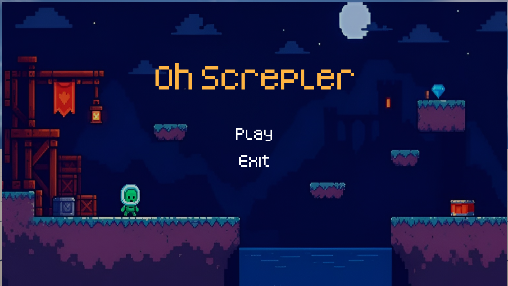
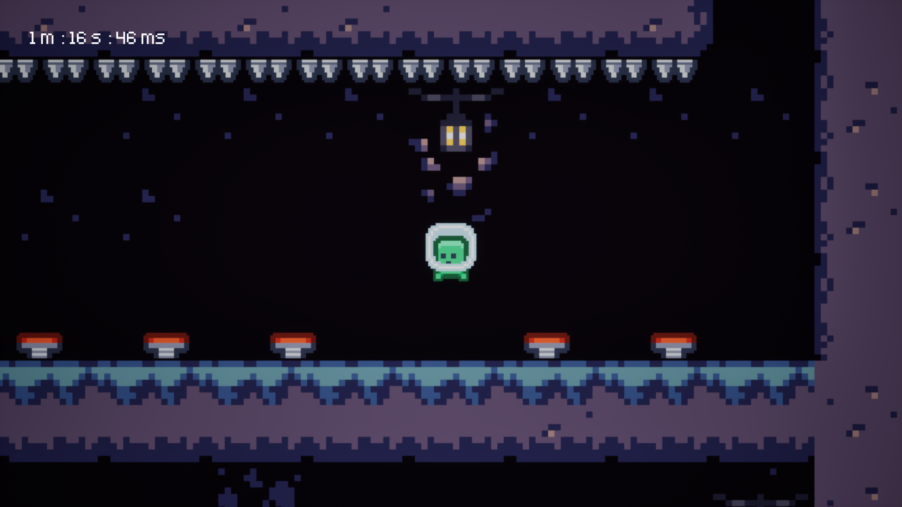
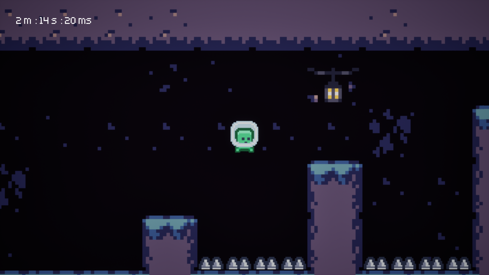

# 🎮 OhScrepler

> **A one-screen 2D platformer built with Unreal Engine and Blueprint Visual Scripting.**

**OhScrepler** is my first game development project, created to learn the fundamentals of game development and get hands-on experience with **Unreal Engine**.

The project focuses on platforming, hazards, obstacles, and level design within a single-screen environment.

---

## 📸 Screenshots

  
  
  

---

## 🎮 About the Game

**OhScrepler** is a one-screen platformer where the player must navigate through a challenging level while avoiding hazards and obstacles.

The level and gameplay mechanics were developed as part of my first hands-on experience with Unreal Engine.

### Current Status

* ✅ Core gameplay mechanics completed
* ✅ Level/map designed and implemented
* ✅ Playable game loop

---

## 🛠️ Built With

* **Unreal Engine**
* **Blueprint Visual Scripting**
* 2D Game Development
* Pixel Art Assets

I intentionally used **Blueprints instead of C++** for this project so I could learn Unreal Engine's gameplay systems and development workflow faster.

For my next project, I plan to move toward **C++** and explore how C++ and Blueprints can be used together in Unreal Engine.

---

## 📚 Learning Resource

Since this was my first game, I followed a tutorial to understand the fundamentals of creating a 2D platformer in Unreal Engine.

**Tutorial:**
https://youtu.be/jbElUBw8M2E?si=nd5nAFjfRfK_IWqh

The tutorial was used as a learning reference, while the **level/map was designed by me**.

---

## 🎨 Assets & Credits

The project uses the following assets:

### Kenney — Pixel Platformer

https://www.kenney.nl/assets/pixel-platformer

### Pimen — Smoke VFX

https://pimen.itch.io/smoke-vfx-1

### GrafxKid — Cave Tileset

https://grafxkid.itch.io/cave-tileset

All asset rights belong to their respective creators.

---

## 📌 Project Status

**First Game Project — In Development**

This project represents my first step into game development and Unreal Engine. The goal was primarily to learn, experiment, and build something playable while developing a foundation for future projects.

